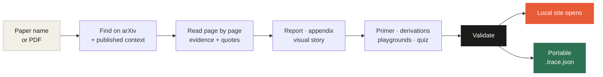
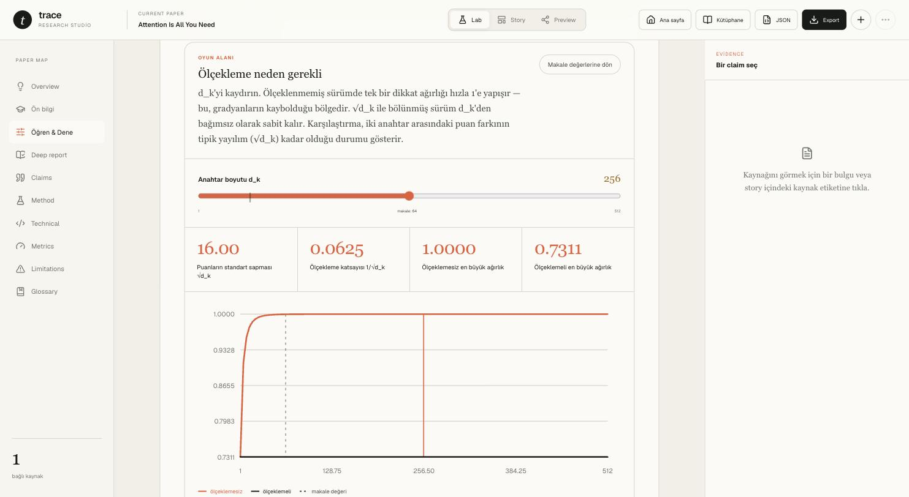
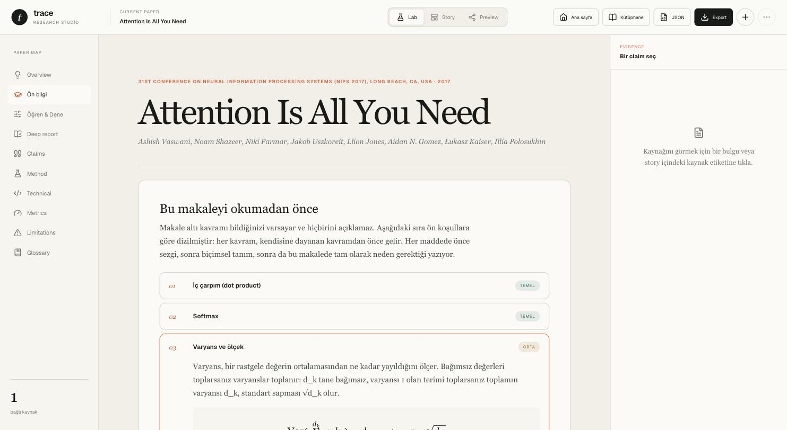
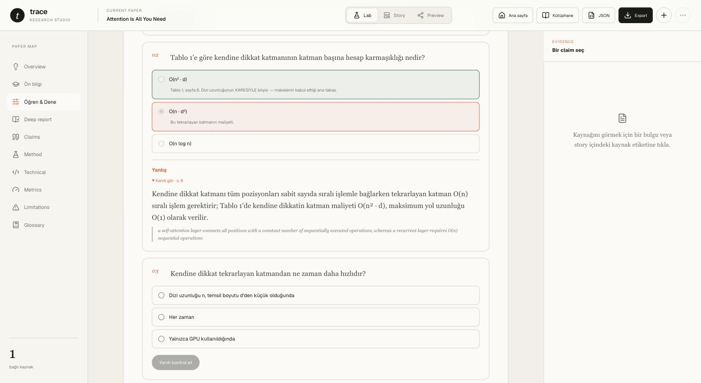
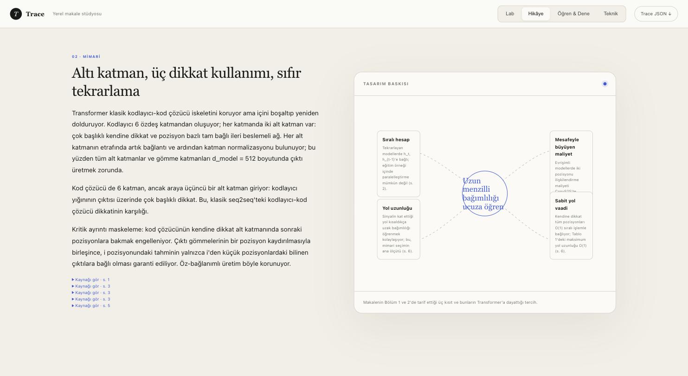
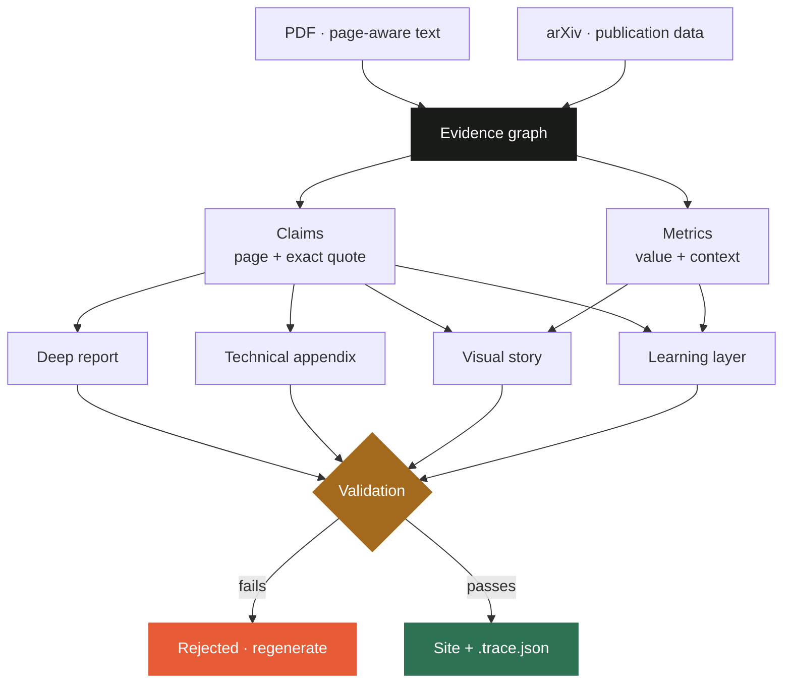

<div align="center">

# Trace — Research Paper Studio

**Name a paper. Get an interactive site where every claim points back to a page and a quote.**

Trace turns a research paper into something you can verify, learn from and experiment with —
running on the coding agent you already use, with no second API key.

[](https://github.com/Ahmet-Ruchan/trace-research-paper-studio/stargazers)
[](https://github.com/Ahmet-Ruchan/trace-research-paper-studio/network/members)
[](https://github.com/Ahmet-Ruchan/trace-research-paper-studio/issues)
[](LICENSE)
[](https://github.com/Ahmet-Ruchan/trace-research-paper-studio/commits/main)

**Works with the agent you already have**

[](#claude-code)
[](#codex)
[](#gemini-cli)

**Built with**


</div>

---

## The problem

Summarising a paper takes seconds. Trusting the summary takes hours.

Ask any model to summarise a paper and you get fluent prose you cannot check. Which sentence
came from which page? Is this something the authors measured, or something they suggested?
To find out you have to go back to the paper — so the summary saved you nothing.

**Trace inverts that.** Every claim carries the page and the exact quote it rests on. Measured
results, author interpretation and background are labelled separately. Anything the excerpt does
not directly support is never marked verified.

---

## One sentence is the whole interface

You do not need the PDF.

```text
Explain Attention Is All You Need using the Trace plugin.
```



Trace finds the paper on arXiv, downloads it, gathers what is publicly known about it (version
history, DOI, the venue it was published in, citation counts), reads it page by page, and opens
a finished local site in your browser.

---

## What you actually get

### Run the paper's own equations

The paper argues that dot products must be divided by `√d_k`. It never plots it. Drag the
slider and watch the unscaled attention weight collapse onto 1.0 while the scaled one holds
steady. The slider **starts at the paper's value, marks it on the track and the chart, and
warns you the moment you leave the region the paper actually verified**.



### Learn what the paper assumes and never explains

Prerequisites ordered so that nothing depends on something you have not read yet. Each one says
why *this* paper needs it — not a generic definition. LaTeX renders as native MathML.



### Check whether you actually understood it

Every question is linked to evidence. Get one wrong and it shows you the page and the original
quote behind the right answer.



### Read it as a narrative, with the source one click away



---

## Install in under a minute

<details open>
<summary><b id="claude-code">Claude Code</b></summary>

```bash
claude plugin marketplace add Ahmet-Ruchan/trace-research-paper-studio --scope user
claude plugin install trace-paper-studio@trace-research-tools --scope user
```

Restart Claude Code. That is it.

</details>

<details>
<summary><b id="codex">Codex</b></summary>

```bash
codex plugin marketplace add Ahmet-Ruchan/trace-research-paper-studio --ref main
codex plugin add trace-paper-studio@trace-research-tools
```

Restart Codex or open a new session. You can also invoke the skill explicitly with
`$trace-paper-studio`.

</details>

<details>
<summary><b id="gemini-cli">Gemini CLI</b></summary>

```bash
gemini extensions install https://github.com/Ahmet-Ruchan/trace-research-paper-studio
```

Restart the CLI or open a new session.

</details>

**Requirements:** Node.js 20+, and `pdftotext` (from Poppler) for page-accurate extraction.
Without it the agent falls back to its own PDF reader.

```bash
brew install poppler        # macOS
sudo apt install poppler-utils   # Debian / Ubuntu
```

### Then ask

```text
Explain Attention Is All You Need using the Trace plugin.
```

```text
Take this paper and give me the output using the Trace plugin: ./paper.pdf
```

The browser opens when it is done. The same folder holds a `.trace.json` you can archive,
share, or import into the full application.

---

## Why it is different

| | Typical AI summary | Trace |
| --- | --- | --- |
| Provenance | Prose you have to trust | Page + exact quote per claim |
| Claim types | Blended together | Measured result / interpretation / background, labelled |
| Uncertainty | Hidden | Unsupported statements stay `needs-review` |
| Your role | Read | Read, run the equations, test yourself |
| Missing data | Plausible guess | Source dropped rather than guessed |
| Cost | Another API key | The model your agent already runs |

Three decisions do most of the work:

**Wrong data is worse than no data.** While building this, a metadata source returned another
paper's citation count for LoRA — 2,516 instead of 22,087. Rather than patch around it, that
lookup path is disabled entirely. If a source cannot answer reliably, it is omitted.

**Near misses get flagged, not guessed.** Ask for "denoising diffusion probabilistic models"
and arXiv will happily hand you *Improved* Denoising Diffusion Probabilistic Models. Resolution
searches the title field first, then requires a near-exact match with a clear margin over the
runner-up — otherwise it reports the candidates and asks.

**Imported projects are untrusted input.** A `.trace.json` can come from anywhere, so the
interactive maths is declarative: parsed by a restricted grammar and evaluated on a pure AST
with length, node and depth limits. Never `eval`, never `new Function`.

---

## The evidence chain



Validation is not advisory. A story cannot cite a claim that does not exist, a comparison chart
cannot show a number absent from the evidence, and a playground cannot ship unless its formula
parses, references only declared parameters, and returns a finite value at the paper's own
configuration.

---

## The full application

The plugin is one way in. The web app adds generation with your own provider keys, an editable
narrative, and a local library.

```bash
git clone https://github.com/Ahmet-Ruchan/trace-research-paper-studio.git
cd trace-research-paper-studio
npm install
npm run dev
```

Open `http://localhost:3000`. Import any `.trace.json` from **Library → Trace JSON**, or start
from the built-in example with `?sample=1`.

**Workspaces:** `Lab` inspects the evidence, `Story` edits the narrative, `Preview` is the
reading experience.

<details>
<summary><b>Model providers</b></summary>

<br>


Run everything on one model, or split the work across four roles — Evidence, Technical, Report
and Visual — each with its own provider and key. Keys are used for the active request only;
they are never written to local storage or included in exports.

The plugin path needs none of this: it uses whatever model your agent is already running.

</details>

<details>
<summary><b>Manual bridge commands</b></summary>

<br>

Agents run these automatically; they are documented for debugging.

```bash
# Resolve from a name, download, collect published context
npm run trace:agent -- prepare --title "attention is all you need" --depth deep

# Or by arXiv id, or from a local file
npm run trace:agent -- prepare --arxiv 1706.03762 --depth deep
npm run trace:agent -- prepare --paper "paper.pdf" --depth deep

# --strict also requires the learning blocks the depth mandates
npm run trace:agent -- validate --strict --project ".trace/jobs/paper/paper.trace.json"
npm run trace:agent -- deliver --project ".trace/jobs/paper/paper.trace.json"
```

With `--title`, the command reports which paper it matched, the runner-up candidates and a
`confident` flag. Re-run with `--pick <n>` or `--arxiv <id>` to switch.

`deliver` keeps the JSON, builds the site, starts a loopback-only server and opens the browser.
Pass `--no-open` for headless environments; it still returns the URL and JSON path.

</details>

---

## Development

```bash
npm run dev              # development server
npm run lint             # eslint
npm run test             # vitest
npm run build            # production build
npm run build:artifacts  # regenerate the committed viewer + validator
npm run check            # everything above, in order
```

<details>
<summary><b>Architecture notes worth knowing before contributing</b></summary>

<br>

**One render source, two runtimes.** The visual grammars and interactive components live in
`src/visuals/` and are compiled twice — as real React for the app, and through preact for the
standalone viewer. A grammar is written once instead of three times. `src/visuals/**` is an
eslint-restricted zone: no `next/*`, no `lucide-react`, no `node:*`.

**The plugin validator is the schema, not a copy of it.** `plugins/.../scripts/generated/validator.mjs`
is a bundle of the application's actual Zod schema and integrity rules. A rule cannot pass one
side and fail the other.

**Two files are generated but committed**, because the plugin must stay dependency-free at run
time:

| Artifact | Source | Rebuild |
| --- | --- | --- |
| `plugins/.../assets/viewer.html` | `viewer/` + `src/visuals/` | `npm run build:viewer` |
| `plugins/.../scripts/generated/validator.mjs` | `src/lib/schema.ts` + integrity rules | `npm run build:validator` |

Never edit them by hand. `npm run check` rebuilds both and fails if the committed copies drifted.

</details>

<details>
<summary><b>Project structure</b></summary>

<br>

```text
src/
├── app/                        # Next.js app router, generation API, design system
├── components/                 # Workspace shell, Lab, Story editor, Preview, Library
├── visuals/                    # SHARED render layer — compiled for both hosts
│   ├── visual-renderer.tsx     #   eleven visual grammars
│   ├── interactive/            #   playground · simulation · data explorer
│   ├── teaching/               #   primer · derivations · quiz · application guide
│   ├── math.tsx                #   LaTeX → MathML with an output allowlist
│   └── chart.ts                #   dependency-free SVG scales and paths
└── lib/
    ├── schema.ts               # Evidence, report, story and learning contracts
    ├── formula.ts              # Restricted grammar + pure AST evaluator
    ├── generation-validation.ts# Cross-contract integrity checks
    ├── plugin-validator-entry.ts# Bundled into the plugin — no mirrored rules
    └── ...

viewer/                         # Standalone viewer app (preact build target)
scripts/                        # build-viewer · build-plugin-validator · drift check
examples/                       # Flagship enriched project, covered by tests
plugins/trace-paper-studio/     # Codex + Claude Code plugin, skill, contract, bridge
```

Keep local PDFs under `ML Research Papers/`; that directory is git-ignored.

</details>

---

## Security and trust model

- Imported `.trace.json` files are untrusted input. Interactive maths is declarative and
  evaluated on a restricted AST — never `eval` or `new Function`.
- Paper resolution reaches an allowlisted set of hosts over HTTPS only, verifies every redirect
  against that allowlist, caps the download while streaming, and checks the `%PDF-` signature.
  Downloaded files are never executed.
- A context source that returns an unreliable record is dropped rather than trusted.
- LaTeX is rendered to MathML and passed through a tag and attribute allowlist.
- Supplementary URLs are restricted by protocol, DNS/IP range, redirect count, response type,
  timeout and payload size.
- PDF and web content are treated as source material, never as instructions.
- Provider keys are used only for the active request and never appear in exports.
- Verified paper claims require an excerpt and a visible page number.
- Comparison visuals may only use numeric values already recorded in evidence.

> No extraction system replaces reading the original paper. Trace makes checking it faster and
> more visible; it does not remove the need for it.

---

## Status

Working today: evidence contracts, deep report, technical appendix, eleven visual grammars, the
learning layer (primer, derivations, playgrounds, simulations, quiz, application guide), arXiv
resolution from a paper's name, local library, exports, the native plugin for Codex / Claude
Code / Gemini CLI, and generation through Gemini, OpenAI, Claude and OpenRouter.

Not there yet: hosted publishing, accounts, shared persistence, local and open-weight providers.

*Attention Is All You Need* ships fully enriched in `examples/`, covered by tests so it cannot
silently fall behind the schema.

## Roadmap

- [ ] Local and open-weight provider adapters
- [ ] Section-level regeneration with evidence locking
- [ ] Side-by-side paper comparison
- [ ] Project revisions and reusable narrative templates
- [ ] Shareable hosted stories with publication controls
- [ ] Team review, annotations and claim approval

---

## Star history

<a href="https://star-history.com/#Ahmet-Ruchan/trace-research-paper-studio&Date">
  
</a>

## Contributing

Issues and pull requests are welcome. Run `npm run check` before opening a PR — it rebuilds the
generated artifacts, lints, tests and builds, and will tell you if a committed artifact drifted.

## License

[MIT](LICENSE) © Ahmet Ruçhan Avcı

<div align="center">
<br>
<sub>If Trace saved you an afternoon of cross-checking, a star helps other people find it.</sub>
</div>
