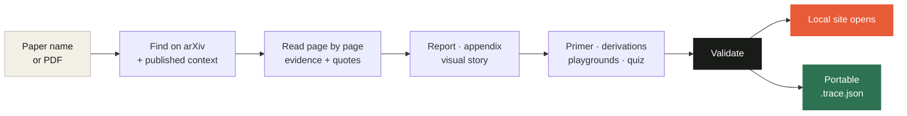
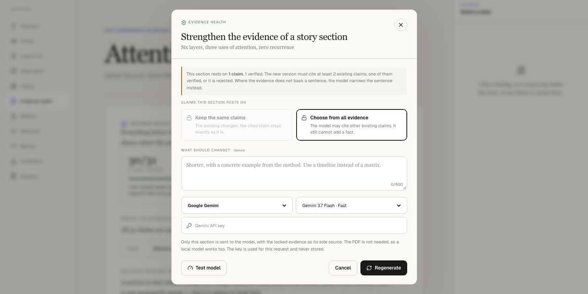
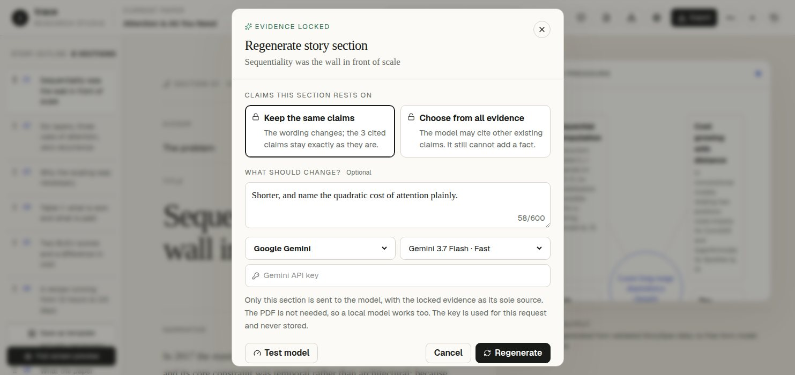
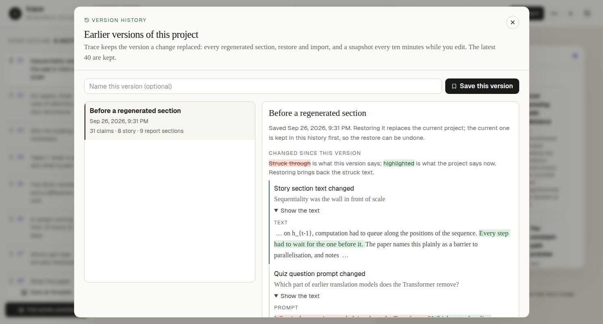
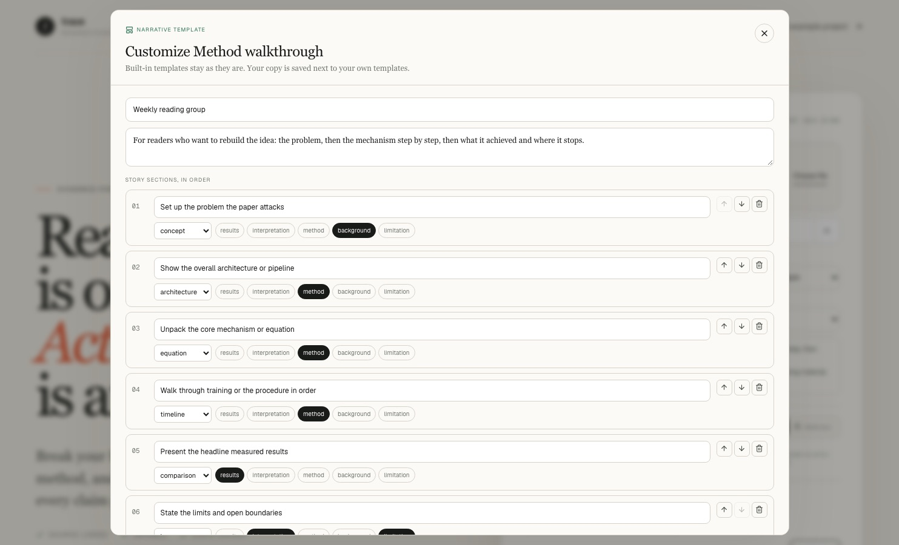
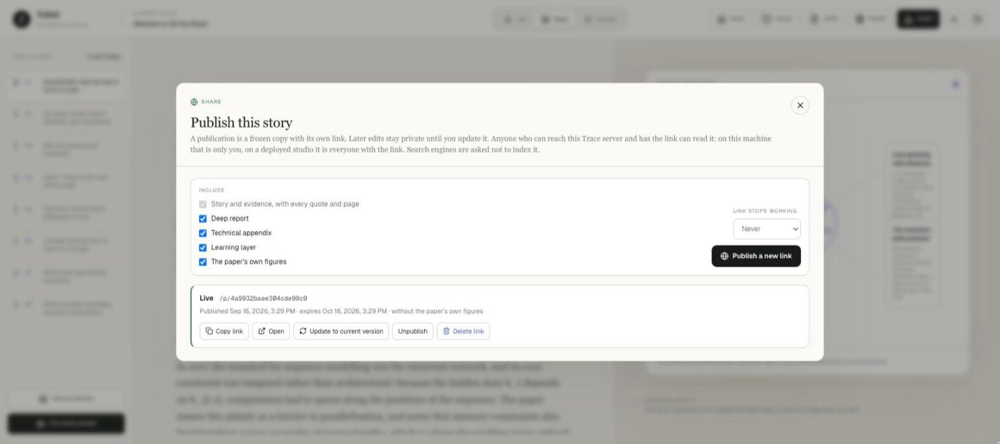
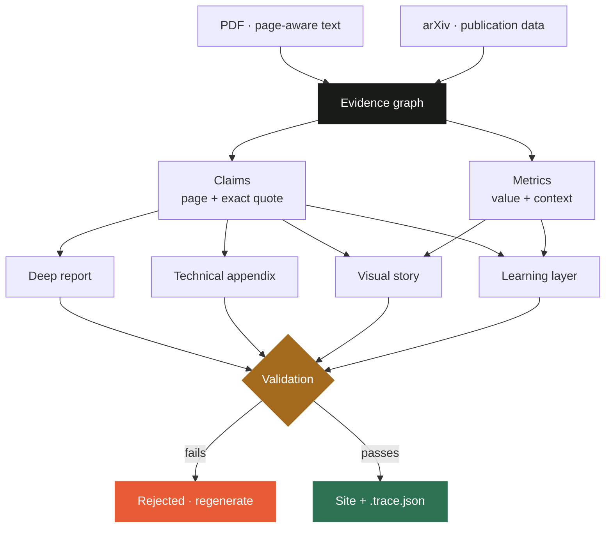

<div align="center">


# Trace — Research Paper Studio

**Name a paper. Get an interactive site where every claim points back to a page and a quote.**

Trace turns a research paper into something you can verify, learn from and experiment with —
running on the coding agent you already use, with no second API key.

[](https://github.com/Ahmet-Ruchan/trace-research-paper-studio/actions/workflows/check.yml)
[](https://github.com/Ahmet-Ruchan/trace-research-paper-studio/stargazers)
[](https://github.com/Ahmet-Ruchan/trace-research-paper-studio/network/members)
[](https://github.com/Ahmet-Ruchan/trace-research-paper-studio/issues)
[](LICENSE)
[](https://github.com/Ahmet-Ruchan/trace-research-paper-studio/commits/main)

**Works with the agent you already have**

[](#claude-code)
[](#codex)
[](#antigravity-cli)

**Built with**


</div>

---

## What's new

**0.21**

| | |
| --- | --- |
| **[Take it with you](#take-it-with-you)** | One **Export** menu: a Markdown report for Obsidian or Notion, a printable report you save as PDF, a slide deck for a paper club, BibTeX and RIS for Zotero, Anki flashcards, and the interactive site. Every claim keeps its quote and page in all of them. |
| **[The paper's equations as runnable code](#take-it-with-you)** | A Jupyter notebook generated from the playgrounds: NumPy functions that start at the paper's own values, with the same sweep the playground draws. Translated from the parsed formula, never pasted as text. |
| **Citations for the whole graph** | The citation graph downloads the paper and the works around it as one `.bib` file. |

All formats work from your agent too (`export --format`).

---

## The problem

Summarising a paper takes seconds. Trusting the summary takes hours.

Ask any model to summarise a paper and you get fluent prose you cannot check. Which sentence
came from which page? Is this something the authors measured, or something they suggested?
To find out you have to go back to the paper — so the summary saved you nothing.

**Trace inverts that.** Every claim carries the page and the exact quote it rests on. Measured
results, author interpretation and background are labelled separately. Anything the excerpt does
not directly support is never marked verified.

---

## One sentence is the whole interface

You do not need the PDF.

```text
Explain Attention Is All You Need using the Trace plugin.
```



Trace finds the paper on arXiv, downloads it, gathers what is publicly known about it (version
history, DOI, the venue it was published in, citation counts), reads it page by page, and opens
a finished local site in your browser.

### Start from a DOI or a repository link

Not every field lives on arXiv. Give a DOI, or a link or id from bioRxiv, medRxiv, PubMed Central,
ACL Anthology or OpenReview, and Trace looks for the open-access copy: the arXiv version when one
exists, then the repository's own PDF, Europe PMC's open-access archive, and the open-access
locations OpenAlex lists. A title that arXiv cannot match with certainty is searched on OpenAlex too.

```text
Explain 10.1101/2021.10.04.463034 using the Trace plugin.
Explain https://aclanthology.org/2020.acl-main.1 using the Trace plugin.
```

Trace downloads only from that short list of repositories, never from a publisher's site. When the
only open copy lives somewhere else, it tells you where, and you pass the PDF yourself. OpenReview
and the PubMed Central website may ask for a browser check; Trace does not try to get around it. For
PubMed Central it uses the open-access archive EBI publishes for programs; for OpenReview it asks
you for the PDF or the title. Set `UNPAYWALL_EMAIL` to let Trace ask Unpaywall as well.

The studio has the same search under the upload box: type a title, a DOI, an arXiv id or a link.

---

## What you actually get

### Run the paper's own equations

The paper argues that dot products must be divided by `√d_k`. It never plots it. Drag the
slider and watch the unscaled attention weight collapse onto 1.0 while the scaled one holds
steady. The slider **starts at the paper's value, marks it on the track and the chart, and
warns you the moment you leave the region the paper actually verified**.


### Learn what the paper assumes and never explains

Prerequisites ordered so that nothing depends on something you have not read yet. Each one says
why *this* paper needs it — not a generic definition. LaTeX renders as native MathML.


### Check whether you actually understood it

Every question is linked to evidence. Get one wrong and it shows you the page and the original
quote behind the right answer.


### Read it as a narrative, with the source one click away

The paper's own figures sit beside the paragraph that argues them — the join is the claims they
share, not a guess about where a picture belongs.


### See where the evidence is thin

Trace's whole claim is that every sentence ties back to a page. The evidence health panel makes
that auditable instead of asking you to trust it: how many claims are verified rather than
needs-review, which pages between the first and last citation nothing ever reaches, which
collected claims the narrative never used, and which sections rest on a single claim. All of it
is computed from the project's own data — no model is asked, so a shared `.trace.json` reports
the same numbers offline.

In the studio, every thin section has a **Strengthen** button. It rewrites that section so it
cites at least two existing claims, one of them verified. If the rewrite is still thin, it is
refused. Where the evidence does not back a sentence, the model narrows the sentence instead.



```text
Strengthen the thin sections of my Trace project using the Trace plugin.
```

### Check every quote against its page

`verified` is what the model says about its own claim. Trace also checks it mechanically: the text
of every page is extracted from the PDF (`pdftotext`), and each quote is searched for on the page it
cites, or the page next to it. Differences in spacing, hyphenation, ligatures and punctuation are
ignored; different words are not. A verified claim none of whose quotes can be found is kept and
marked needs-review. Nothing is ever upgraded, because a program can tell that a quote is there, not
that it supports the claim.

The result is written into the project, so a shared `.trace.json` shows that its quotes were checked
and which ones were not found, without the PDF. A project that was never checked says so instead of
showing a pass. A missing quote is not always an invented one: tables, equations and scanned pages
do not survive text extraction, which is why the claim is kept for you to look at.

**Show on the page** in the evidence drawer goes one step further: it renders the cited page and
marks the quoted words on it, so you read the sentence in its place instead of searching a page for
it. When the words are not on that page it says so and shows the page anyway.

It runs during every new analysis. For a project you imported, **Check the quotes against the PDF**
in the evidence health panel asks for the PDF; if almost nothing matches, it assumes the wrong file
and changes nothing. The shipped *Attention Is All You Need* example was checked against the arXiv
PDF: all 67 quotes were found.

```text
Verify the quotes of my Trace project against the PDF using the Trace plugin.
```

### See how each model's quotes held up

Every project records which model wrote it and which of its quotes were found on their page, so your
library already measures your models. **Model record** in the library adds that up per model: how many
quotes were found out of how many were checked, across how many papers, and how many of its claims a
reviewer approved or rejected. In a model team, each quote goes to the model that wrote it: the
technical model writes the method and results evidence, the evidence model the rest.

A rate from three quotes is not a rate from three hundred. Each rate shows the range the evidence is
consistent with, and models are sorted by the low end of it. Different models read different papers,
and a scanned or table-heavy paper lowers anyone's rate. So when the same paper was analysed with two
models, the two are lined up side by side: same PDF, same tables in the way. A project whose quotes were
never checked, whose evidence changed after the check, or that does not say which model wrote it is
listed with that reason, not counted. When you pick a model for a new analysis, its record appears
under the picker.

```text
Show me how each model's quotes held up in my Trace library using the Trace plugin.
```

### Let a person review the claims

A model says how sure it is, and a program can check that a quote is on its page. Neither can say
that the quote actually supports the claim. **Review** in the studio is where a person does that. The
queue puts first the claims whose quote was not found, then the ones the model was unsure about, then
the ones the narrative uses. You approve or reject each under your name, with an optional note.

A decision never changes the model's own `confidence`; it is stored next to it, so "the model was
sure" and "someone looked at the page" stay two different things. A rejected claim stays in the
ledger. Trace shows which sections still rest on it, and a rewrite of those sections is not allowed
to cite it again. Reviews are part of the `.trace.json`, so they travel with the project. An agent
cannot write them.

### Ask the evidence

Ask a question in the **Ask** tab. The model answering has not read the paper: it sees only the
claims, metrics and glossary collected in the project, must list the claims it used, and each one
opens its quote and page. When the collected evidence does not cover the question, the answer says
that instead of filling the gap from general knowledge. Claims a reviewer rejected are not shown to
the model. Because no PDF is sent, a local model can answer too. Nothing is saved.

### Take it with you

**Export** in the studio writes the project in the form you need next. All of it is computed from
the `.trace.json` alone, with no network and no model, and every claim carries its quote and page
wherever it goes.

- **Markdown report**: the deep report, method, equations, reported numbers, limitations and the
  full evidence ledger. Obsidian, Notion and GitHub import it as it is. Each claim shows all three
  trust marks separately: what the model said, whether the quote was found on its page, and what a
  reviewer decided.
- **Printable report (PDF)**: the same report as one page without scripts, laid out for paper.
  Print it and choose *Save as PDF*.
- **Slides**: one slide per story section with its first two sentences, the quotes behind it and
  the paper's figure when the section shares a claim with it. Arrow keys move, **N** shows the full
  text, printing gives one slide per page.
- **Jupyter notebook**: each formula playground as NumPy functions that start at the paper's own
  configuration, plus the sweep the playground draws. The code is generated from the parsed
  formula, so a project file cannot put arbitrary code into the notebook. A formula that cannot be
  translated exactly is left out and the notebook says so.
- **BibTeX / RIS** for Zotero, Mendeley, EndNote and LaTeX.
- **Anki flashcards** and the **interactive site**.

```text
Export my Trace project as slides using the Trace plugin.
```

### Study it with Anki

**Export → Anki flashcards** in the studio downloads an import file with one card per primer concept, quiz question and
glossary term. The back of every card carries the quote and the page it rests on. In Anki, choose
File → Import; the file sets the deck, the note type and the tags itself.

```text
Make Anki flashcards from my Trace project using the Trace plugin.
```

### Compare two papers without being told which one wins

Pick two projects from the library and Trace lines them up: the same benchmark under the same
unit, the same term defined twice, each side's limitations. It never says which paper is right —
that would be interpretation. Every number carries the page it came from and both sources stay
visible.

### Line up more than two papers

Pick three to six projects and the comparison becomes a literature map. The papers are put in year
order and lettered. A benchmark that two or more of them report under the same name and unit is
tracked across them, each value with its page. Terms that recur with different definitions are shown
side by side, and so is what each paper says it cannot do. A value that grows over the years is not
presented as progress: the dataset, the setup and which direction is better are things the papers
say. Like the two-paper view, it is computed from the `.trace.json` files alone.

### Search what your papers claim

Switch the library search from **Papers** to **Claims** and it goes through every claim of every
paper you have analysed, together with their quotes. Ask which of your papers says anything about
layer normalization, and the answer is the claims themselves, each with its paper, page and quote.
Each one also shows the same three trust marks as in the project: what the model said, whether the
quote was found on its page, and what a reviewer decided. A rejected claim is still listed, last.
Every word you type must appear in the claim or its quote. Nothing but the claims is searched, and
no model is asked. Click a result and the project opens on that claim.

### Group papers with tags

Give a paper a tag from its library card and the tag becomes a collection. Pick it to see only those
papers, search only their claims, or compare and map them in one click. Typing "nlp" joins an
existing "NLP" tag instead of starting a second one. Tags belong to your library, not to the paper:
they are kept in `~/.trace/library/tags.json`. So tagging a paper does not add a version to its
history, does not change its `.trace.json`, and never goes out with a published link or an export.

### See what a paper builds on, and what built on it

**Citations** in the studio opens the paper's citation graph: the most-cited works it references on
one side, the most-cited works that cite it on the other, from OpenAlex. This is context, not
evidence. None of it comes from the paper's pages and the counts change, so it is fetched when you
open it, shown with the date, and never written into the project. A paper that OpenAlex cannot match
by DOI is matched by exact title only; a graph for the wrong paper would be worse than none.

**Analyse** on any work looks it up and loads its PDF into the upload screen. From an agent, the
same graph is in `context.json` after `prepare`, and on its own:

```text
Show me the citation graph of my Trace project using the Trace plugin.
```

### Rewrite one section without touching the evidence

Don't like one section of the story or the deep report? Regenerate just that section. The
evidence stays locked. By default the new version must cite exactly the claims the old one
did, so only the wording changes. You can also let it choose again from the claims already
collected, but it can never add a new fact. It goes through the same integrity checks as a
full generation, and you see the current and proposed versions side by side before anything
is replaced. The section request carries only the locked evidence, never the PDF, so a local
model can do this too. **Test model** sends a short request first and tells you how long a section
would take on that model, and whether it fits the time limit, before you wait for it. The
analysis screen has the same check for a whole analysis: **Test models** estimates the longest
step of every model you assigned, before the PDF is sent.

The same lock works on the learning layer. A primer concept, a quiz question, a derivation or an
equation in the technical appendix can each be rewritten on its own. Each keeps its own rules: a
quiz question needs the right number of correct options, a derivation stays attached to its
equation, and a concept other concepts build on keeps its subject.



```text
Rewrite the limitations section of my Trace project, shorter, using the Trace plugin.
Make the first quiz question of my Trace project harder using the Trace plugin.
```

### Go back to any earlier version

Every regenerated section, restore and import keeps the version it replaced. While you edit,
Trace keeps a snapshot every ten minutes. You can also name a version yourself. The history panel
shows what has changed since each version: which story and report sections, which claims, and
which primer concepts, quiz questions, derivations and equations. Open **Show the text** on a
change to see it word by word, with the older version struck through and the current one
highlighted. Restoring is itself a change, so a restore can be undone too. Changes an
agent makes through the plugin land in the same history.



### Reuse a structure that worked

Save a story's structure as a template: the order of its sections, the visual each one uses and
the kinds of claims it rests on, plus the order of the deep report. The template carries no text.
Pick it when you analyse the next paper, or ask your agent to use it. Two templates are built in:
*Method walkthrough* and *Results briefing*. A template is checked against the integrity rules
before anything is generated, so a structure that could never pass is refused up front.
Saved templates can be edited later: add, remove or reorder sections, and change each one's
purpose, visual and claim kinds. The rules are checked as you edit. Built-in templates stay as
they are, and **Customize a copy** saves your own version. Projects already analysed with a
template keep their own copy of it.



```text
Explain Denoising Diffusion Probabilistic Models as a results briefing using the Trace plugin.
```

### Publish a story with a link you control

**Publish** freezes a copy of the project behind an unguessable link that the Trace server itself
serves at `/p/<id>`. Later edits stay private until you update the link. You choose whether the
deep report, the technical appendix, the learning layer and the paper's own figures go out. The
evidence quotes always do, because a claim without its page is not something a reader can check.
You can unpublish a link, publish it again, let it expire after 7, 30 or 90 days, or delete it.
Removing the project closes its links too. An unpublished, expired and never-existing link all
return the same page, and the page asks search engines not to index it.

The link works for anyone who can reach that server. When the studio runs on your machine, that is
only you. When it is deployed somewhere public, it is everyone who has the link.



### Send someone a link to one claim

Every claim and every story section has its own anchor, in the studio and in the portable
single-file copy alike. The address bar tracks what is open, so the link is always there to copy.

---

## Install in under a minute

Pick your agent. Two commands, then restart — the plugin is the same on all three.

<a id="claude-code"></a>

### Claude Code

```bash
claude plugin marketplace add Ahmet-Ruchan/trace-research-paper-studio --scope user
claude plugin install trace-paper-studio@trace-research-tools --scope user
```

Restart Claude Code. That is it.

<a id="codex"></a>

### Codex

```bash
codex plugin marketplace add Ahmet-Ruchan/trace-research-paper-studio --ref main
codex plugin add trace-paper-studio@trace-research-tools
```

Restart Codex or open a new session. You can also invoke the skill explicitly with
`$trace-paper-studio`.

<a id="antigravity-cli"></a>

### Antigravity CLI

Antigravity installs plugins from a directory, so clone first:

```bash
git clone https://github.com/Ahmet-Ruchan/trace-research-paper-studio.git
agy plugin install trace-research-paper-studio/plugins/trace-paper-studio
```

Confirm with `agy plugin list`, then restart the CLI or open a new session.
Do not have the CLI yet? `curl -fsSL https://antigravity.google/cli/install.sh | bash`

### Already installed? Update

```bash
# Claude Code
claude plugin marketplace update trace-research-tools
claude plugin update trace-paper-studio@trace-research-tools --scope user

# Codex
codex plugin marketplace upgrade trace-research-tools

# Antigravity CLI: pull, then reinstall from the same directory
git -C trace-research-paper-studio pull
agy plugin install trace-research-paper-studio/plugins/trace-paper-studio
```

Restart the agent afterwards so it loads the new skill.

**Requirements:** Node.js 20+, and `pdftotext` (from Poppler) for page-accurate extraction.
Without it the agent falls back to its own PDF reader.

```bash
brew install poppler        # macOS
sudo apt install poppler-utils   # Debian / Ubuntu
```

### Then ask

```text
Explain Attention Is All You Need using the Trace plugin.
```

```text
Take this paper and give me the output using the Trace plugin: ./paper.pdf
```

```text
Rewrite section 4 of that Trace project so it names the quadratic cost plainly.
```

```text
Publish a link to it without the paper's figures, expiring in 30 days.
```

When it finishes, the browser is already open — both the self-contained site and the full
application, with the project sitting in your Library. Nothing to export, nothing to import,
no server to start. The same folder keeps a portable `.trace.json` you can archive or share.

---

## Why it is different

| | Typical AI summary | Trace |
| --- | --- | --- |
| Provenance | Prose you have to trust | Page + exact quote per claim |
| Claim types | Blended together | Measured result / interpretation / background, labelled |
| Uncertainty | Hidden | Unsupported statements stay `needs-review` |
| Your role | Read | Read, run the equations, test yourself |
| Missing data | Plausible guess | Source dropped rather than guessed |
| Cost | Another API key | The model your agent already runs |

Three decisions do most of the work:

**Wrong data is worse than no data.** While building this, a metadata source returned another
paper's citation count for LoRA — 2,516 instead of 22,087. Rather than patch around it, that
lookup path is disabled entirely. If a source cannot answer reliably, it is omitted.

**Near misses get flagged, not guessed.** Ask for "denoising diffusion probabilistic models"
and arXiv will happily hand you *Improved* Denoising Diffusion Probabilistic Models. Resolution
searches the title field first, then requires a near-exact match with a clear margin over the
runner-up — otherwise it reports the candidates and asks.

**Imported projects are untrusted input.** A `.trace.json` can come from anywhere, so the
interactive maths is declarative: parsed by a restricted grammar and evaluated on a pure AST
with length, node and depth limits. Never `eval`, never `new Function`.

---

## The evidence chain



Validation is not advisory. A story cannot cite a claim that does not exist, a comparison chart
cannot show a number absent from the evidence, and a playground cannot ship unless its formula
parses, references only declared parameters, and returns a finite value at the paper's own
configuration.

---

## The full application

The plugin is one way in. The web app adds generation with your own provider keys, an editable
narrative, and a local library. Projects are stored as files under `~/.trace/library`, shared by
Codex, Claude Code, Antigravity and every Trace Studio launch directory. Existing browser-only
projects migrate there automatically; removing a Library item removes its stored file and its
version history and its tags. Earlier versions live under `~/.trace/library/revisions`, tags in
`~/.trace/library/tags.json`, saved templates under `~/.trace/templates`.

```bash
git clone https://github.com/Ahmet-Ruchan/trace-research-paper-studio.git
cd trace-research-paper-studio
npm install
npm run dev
```

Open `http://localhost:3000`. The built-in demo **is** the flagship project: press *Open the
example project* (or add `?sample=1`) and the fully enriched *Attention Is All You Need* loads —
English or Turkish, chosen from your browser language. Both files also ship as plain downloads
at `/examples/`, and any `.trace.json` imports through **Library → Trace JSON**.

**Workspaces:** `Lab` inspects the evidence, `Story` edits the narrative, `Preview` is the
reading experience. **Regenerate** on a story section, or on a deep report section in `Lab`,
rewrites only that section against the locked evidence. The same button appears on primer
concepts, quiz questions, derivations and equations, and **Strengthen** in the evidence health
panel rewrites a thin section with more evidence. The history button in the header opens
earlier versions of the project. **Save as template** in `Story` keeps the structure for the next
paper.

**Aa** in the header sets the text size, from compact to 125%. Every size in the studio is on one
type scale in `rem`, so the choice and your browser's own font size setting both enlarge everything
together. The smallest text is 12 px, and a test fails if a rule goes below it. The choice is kept
in this browser only.

<details>
<summary><b>Model providers</b></summary>

<br>


Run everything on one model, or split the work across four roles — Evidence, Technical, Report
and Visual — each with its own provider and key. Keys are used for the active request only;
they are never written to local storage or included in exports.

The plugin path needs none of this: it uses whatever model your agent is already running.

</details>

<details>
<summary><b>Manual bridge commands</b></summary>

<br>

Agents run these automatically; they are documented for debugging.

```bash
# Resolve from a name, download, collect published context
npm run trace:agent -- prepare --title "attention is all you need" --language en --depth deep

# Or by arXiv id, or from a local file
npm run trace:agent -- prepare --arxiv 1706.03762 --language en --depth deep
npm run trace:agent -- prepare --paper "paper.pdf" --language en --depth deep

# Or from a DOI, or a bioRxiv / medRxiv / PubMed Central / ACL Anthology / OpenReview link or id
npm run trace:agent -- prepare --doi 10.1101/2021.10.04.463034 --language en
npm run trace:agent -- prepare --source https://aclanthology.org/2020.acl-main.1 --language en

# Check every quote against its page and record the result in the project
npm run trace:agent -- verify --project "paper.trace.json" --paper "paper.pdf"

# Another form of the project: md, html (print to PDF), slides, ipynb, bib, ris, anki
npm run trace:agent -- export --project "paper.trace.json" --format slides

# The citation graph of a project, a DOI or a title
npm run trace:agent -- graph --project "paper.trace.json"

# How each model's quotes held up across the library, and what was left out
npm run trace:agent -- record

# --strict also requires the learning blocks the depth mandates
npm run trace:agent -- validate --strict --project ".trace/jobs/paper/paper.trace.json"
npm run trace:agent -- deliver --project ".trace/jobs/paper/paper.trace.json"

# Rewrite one section with the evidence locked: write a brief, let the agent
# write the section, then splice it in with the app's own checks
npm run trace:agent -- section --project ".trace/jobs/paper/paper.trace.json" --target story:<section-id>
npm run trace:agent -- splice --brief ".trace/jobs/paper/revisions/story-<section-id>.brief.json"
# Targets also cover primer:<id>, quiz:<id>, derivation:<id> and equation:<id>.
# validate lists thinSections; --goal strengthen rewrites one with more evidence
npm run trace:agent -- section --project ".trace/jobs/paper/paper.trace.json" --target story:<section-id> --goal strengthen

# Narrative templates: list them, generate with one, save one from a project
npm run trace:agent -- templates
npm run trace:agent -- prepare --arxiv 1706.03762 --language en --depth deep --template method-walkthrough
npm run trace:agent -- save-template --project ".trace/jobs/paper/paper.trace.json" --name "Reading group"

# Publish a shareable link, served by the studio at /p/<id>
npm run trace:agent -- publish --project ".trace/jobs/paper/paper.trace.json" --no-figures --expires-days 30
```

With `--title`, the command reports which paper it matched, the runner-up candidates and a
`confident` flag. Re-run with `--pick <n>` or `--arxiv <id>` to switch.

`deliver` brings up everything in one shot: the portable JSON, the self-contained site on a
loopback-only server, and the studio — reused if already running, otherwise started — with the
project handed straight into its Library. Once a studio has been started successfully its
location is remembered, so later deliveries find it from any directory.

Each paper also receives one accent from a 20-color palette. Trace shuffles the palette once,
uses every color before repeating, and remembers a paper by its PDF fingerprint so regenerating
the same paper keeps the same visual identity.

If no studio can be started, the delivery still succeeds and the agent asks whether to set one
up. Say no and the standalone site still carries a **Show me the command** strip: one click
gives the terminal command, with a copy button. That happens when no copy
of the repository has its dependencies installed — the plugin's own clone ships without them.
`--install-app` installs them once. `--no-app` limits delivery to the standalone site,
`--no-open` suits headless environments, and `stop --site <dir>` shuts down what it started.

</details>

---

## Development

```bash
npm run dev              # development server
npm run lint             # eslint
npm run test             # vitest
npm run build            # production build
npm run build:artifacts  # regenerate the committed viewer + validator
npm run check            # everything above, in order
npm run test:e2e         # browser tests against the production build (run after build)
npm run version:set -- 0.17.0  # write one version into the package and every plugin manifest
```

<details>
<summary><b>Architecture notes worth knowing before contributing</b></summary>

<br>

**One render source, two runtimes.** The visual grammars and interactive components live in
`src/visuals/` and are compiled twice — as real React for the app, and through preact for the
standalone viewer. A grammar is written once instead of three times. `src/visuals/**` is an
eslint-restricted zone: no `next/*`, no `lucide-react`, no `node:*`.

**The plugin validator is the schema, not a copy of it.** `plugins/.../scripts/generated/validator.mjs`
is a bundle of the application's actual Zod schema and integrity rules. A rule cannot pass one
side and fail the other.

**Two files are generated but committed**, because the plugin must stay dependency-free at run
time:

| Artifact | Source | Rebuild |
| --- | --- | --- |
| `plugins/.../assets/viewer.html` | `viewer/` + `src/visuals/` | `npm run build:viewer` |
| `plugins/.../scripts/generated/validator.mjs` | `src/lib/schema.ts` + integrity rules | `npm run build:validator` |

Never edit them by hand. `npm run check` rebuilds both and fails if the committed copies drifted.

</details>

<details>
<summary><b>Project structure</b></summary>

<br>

```text
src/
├── app/                        # Next.js app router, generation API, design system
├── components/                 # Workspace shell, Lab, Story editor, Preview, Library
├── visuals/                    # SHARED render layer — compiled for both hosts
│   ├── visual-renderer.tsx     #   eleven visual grammars
│   ├── interactive/            #   playground · simulation · data explorer
│   ├── teaching/               #   primer · derivations · quiz · application guide
│   ├── math.tsx                #   LaTeX → MathML with an output allowlist
│   └── chart.ts                #   dependency-free SVG scales and paths
└── lib/
    ├── schema.ts               # Evidence, report, story and learning contracts
    ├── formula.ts              # Restricted grammar + pure AST evaluator
    ├── generation-validation.ts# Cross-contract integrity checks
    ├── plugin-validator-entry.ts# Bundled into the plugin — no mirrored rules
    └── ...

viewer/                         # Standalone viewer app (preact build target)
scripts/                        # build-viewer · build-plugin-validator · drift check
public/examples/                # Flagship project: built-in demo, download, test fixture
plugins/trace-paper-studio/     # Plugin for all three agents: skill, contract, bridge
```

Keep local PDFs under `ML Research Papers/`; that directory is git-ignored.

</details>

---

## Run it on a server

```bash
docker compose up --build        # http://localhost:3000, library kept in a volume
```

The image includes Poppler, so the quote check and local-model reading work out of the box. The
library, templates and published links live in `/data` (`TRACE_DATA_DIR`); mount a volume there.
`railway.json` builds the same Dockerfile on Railway with `/api/health` as the health check; any
host that runs a Dockerfile works the same way.

Trace has no accounts. On your own machine that is fine. On a server anyone can reach, set
`TRACE_ACCESS_PASSWORD`: the studio and its API then ask for that password (HTTP Basic, any user
name), while `/p/<id>` published links and the health check stay open. Use HTTPS in front of it.
Provider keys are still typed into the browser by whoever uses the studio and are never stored on
the server.

## Security and trust model

- Imported `.trace.json` files are untrusted input. Interactive maths is declarative and
  evaluated on a restricted AST — never `eval` or `new Function`.
- Paper resolution reaches an allowlisted set of hosts over HTTPS only, verifies every redirect
  against that allowlist, caps the download while streaming, and checks the `%PDF-` signature.
  Downloaded files are never executed. The list holds arXiv, the metadata APIs and a few
  open-access repositories, and no publisher sites. The studio's paper search goes through the same
  module, so a PDF address sent by a browser passes the same checks.
- A repository that asks for a browser check is not worked around. The PubMed Central archive is
  unpacked in memory with its uncompressed size capped.
- Every quote is searched for on the page it cites, for every provider. A claim whose quotes are not
  found cannot stay verified, and the check never upgrades a claim. A PDF uploaded for a re-check is
  read in a temporary directory and deleted; if almost no quote matches, nothing is changed.
- Exports escape project text in Markdown, HTML and BibTeX. The printable report has no scripts; the
  slide deck's only script is fixed navigation code. Notebook code is generated from the parsed
  formula tree: numbers, declared parameters, arithmetic and a fixed table of NumPy functions.
- A reviewer's decision lives at the project root, not inside the claim, so no model output schema
  can produce an "approved" claim. The question in **Ask** is passed to the model as data, and an
  answer that cites an unknown or rejected claim is refused.
- `TRACE_ACCESS_PASSWORD` puts the studio and its API behind one shared password, compared in
  constant time. It is not an account system: published links and the health check stay open.
- A context source that returns an unreliable record is dropped rather than trusted.
- LaTeX is rendered to MathML and passed through a tag and attribute allowlist.
- Supplementary URLs are restricted by protocol, DNS/IP range, redirect count, response type,
  timeout and payload size.
- PDF and web content are treated as source material, never as instructions.
- Provider keys are used only for the active request and never appear in exports.
- Verified paper claims require an excerpt and a visible page number.
- Comparison visuals may only use numeric values already recorded in evidence.
- A publication is a filtered copy: blocks the author leaves out are removed from the served file,
  not hidden. Pages are sent with a strict Content-Security-Policy, `frame-ancestors 'none'`,
  `no-store` and `noindex`, and a missing, unpublished or expired link is indistinguishable.

> No extraction system replaces reading the original paper. Trace makes checking it faster and
> more visible; it does not remove the need for it.

---

## Status

Working today: evidence contracts, deep report, technical appendix, eleven visual grammars, the
learning layer (primer, derivations, playgrounds, simulations, quiz, application guide), the
paper's own figures placed beside the prose that argues them, the evidence health panel, a
mechanical check of every quote against its page with the quote marked on the page image, a claim
review queue, questions answered from the collected evidence only, exports (Markdown and printable
reports, slides, Jupyter notebook, BibTeX/RIS, Anki flashcards), a Docker image with optional password protection,
side-by-side comparison of two projects, section-level regeneration with evidence locking (story, report and learning items),
strengthening thin sections, project version history with word-level diffs, editable narrative
templates, model speed tests before generation, shareable publications with
publication controls,
per-claim and per-section permalinks, resolution from a paper's name, DOI or repository link
(arXiv, bioRxiv, medRxiv, PubMed Central, ACL Anthology), literature maps of up to six projects,
citation graphs, local library, exports, the native plugin for Codex / Claude Code /
Antigravity CLI, and generation through Gemini, OpenAI, Claude, OpenRouter and a local model
server (Ollama, LM Studio, llama.cpp).

A local model can run every stage, so an analysis can stay on your machine from start to finish.
Local servers have no file-upload endpoint and most open-weight models cannot see a document, so in
the two stages that read the paper a local model gets the text extracted from the PDF (`pdftotext`,
from Poppler), with page boundaries kept. If the paper does not fit the model's context, each stage
gets the pages that matter to it and is told which pages it did not see. Because the text is at
hand, every quote is searched for on the page it cites; a claim whose quote cannot be found is kept
but marked needs-review. Figures, layout and some equations are lost on this path, and a scanned PDF
is refused. A cloud provider still gets the PDF itself. Give the model a 32K context or more; set
`TRACE_LOCAL_PAPER_CHARS` to change how much text a stage may receive (default 60,000 characters).
Only a loopback address is accepted — the request leaves the Trace server, and "local model" means
this machine.

Not there yet: accounts, access control beyond an unguessable link, or cloud-synced persistence.

*Attention Is All You Need* ships fully enriched in `public/examples/`, in English and Turkish,
serving at once as the built-in demo, a downloadable artifact and the test fixture — covered
by tests so neither can silently fall behind the schema.

The interface is always English. The analysis is not: **it comes back in the language you wrote
to your agent in** — any language, identified by its BCP-47 tag, with `pt-BR` kept distinct from
`pt-PT`. Nothing is guessed: the bridge cannot see your conversation, so `--language` is required
and fails loudly rather than picking a default that would be wrong for somebody. Quoted evidence
is the one exception; an excerpt stays verbatim in the source's own language, because translating
a quotation breaks the chain back to the page. Content still sorts and uppercases by its own
locale — casing follows the text, not the chrome — and a test scans the interface layer to keep
the two from mixing.

## Roadmap

- [x] Local and open-weight provider adapters
- [x] Side-by-side paper comparison
- [x] Section-level regeneration with evidence locking
- [x] Project revisions and reusable narrative templates
- [x] Shareable hosted stories with publication controls
- [x] Papers beyond arXiv, literature maps, citation graphs and fully local analysis
- [x] Quotes checked against the page text; Docker image and password protection
- [x] Claim review by a person, quotes shown on the page, evidence-locked questions, Anki export
- [x] Exports: reports, slides, runnable notebook, citations
- [ ] Team review with accounts and shared annotations

---

## Star history

<a href="https://star-history.com/#Ahmet-Ruchan/trace-research-paper-studio&Date">
  
</a>

## Contributing

Issues and pull requests are welcome. Run `npm run check` before opening a PR — it rebuilds the
generated artifacts, lints, tests and builds, and will tell you if a committed artifact drifted.

## License

[MIT](LICENSE) © Ahmet Ruçhan Avcı

<div align="center">
<br>
<sub>If Trace saved you an afternoon of cross-checking, a star helps other people find it.</sub>
</div>
